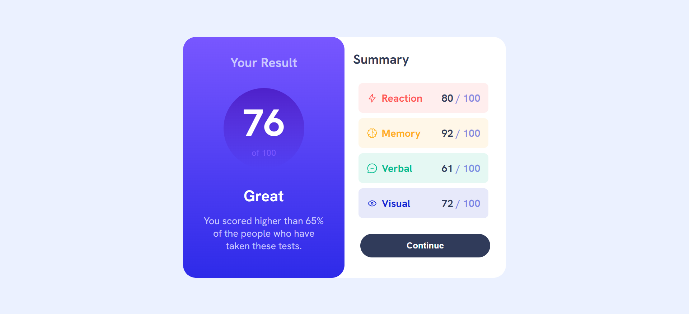

---

# Frontend Mentor - Results Summary Component Solution

This is a solution to the [Results summary component challenge on Frontend Mentor](https://www.frontendmentor.io/challenges/results-summary-component-CE_K6s0maV). This project is designed to help you improve your HTML, CSS, and responsive design skills by building a realistic, user-focused component.

## Table of Contents

- [Overview](#overview)
  - [The Challenge](#the-challenge)
  - [Screenshot](#screenshot)
  - [Links](#links)
- [My Process](#my-process)
  - [Built With](#built-with)
  - [What I Learned](#what-i-learned)
  - [Continued Development](#continued-development)
  - [Useful Resources](#useful-resources)
- [Author](#author)
- [Acknowledgments](#acknowledgments)

## Overview

### The Challenge

Users should be able to:

- View the optimal layout for the interface depending on their device's screen size
- See hover and focus states for all interactive elements on the page
- **Bonus**: Use local JSON data to dynamically populate the content

### Screenshot




### Links

- [Live Site URL](https://your-live-site-url.com)

## My Process

### Built With

- Semantic HTML5 markup
- CSS custom properties
- Flexbox
- Mobile-first workflow

### What I Learned

Working on this project allowed me to reinforce my understanding of responsive design principles and the use of CSS custom properties for maintaining a consistent design theme. I also got more comfortable with implementing flexbox to create a fluid and responsive layout.

Here’s an example of a technique I found particularly useful:

```css
.score-circle {
  background: linear-gradient(to bottom, var(--Violet-blue), var(--Persian-blue));
  width: 150px;
  height: 150px;
  border-radius: 50%;
  display: flex;
  flex-direction: column;
  align-items: center;
  justify-content: center;
}
```

This code snippet demonstrates how I utilized CSS flexbox to center content within a circular container, maintaining a clean and balanced layout.

### Continued Development

Moving forward, I aim to:

- Continue refining my responsive design skills, particularly using CSS Grid for more complex layouts.
- Enhance accessibility by adding `aria-labels` and ensuring better keyboard navigation.
- Explore CSS methodologies like BEM to improve the scalability and maintainability of my code.

### Useful Resources

- [MDN Web Docs on Flexbox](https://developer.mozilla.org/en-US/docs/Learn/CSS/CSS_layout/Flexbox) - A comprehensive guide that helped me better understand flexbox properties.
- [CSS Tricks - A Complete Guide to Flexbox](https://css-tricks.com/snippets/css/a-guide-to-flexbox/) - This article provides detailed examples of how to use flexbox in various scenarios.

## Author

- Frontend Mentor - [@omk1r](https://www.frontendmentor.io/profile/omk1r)
- Twitter - [@yourusername](https://www.twitter.com/omk1rJ)

## Acknowledgments

I would like to thank the Frontend Mentor community for providing feedback and inspiration. The challenges and resources available have been instrumental in my growth as a developer.

---
